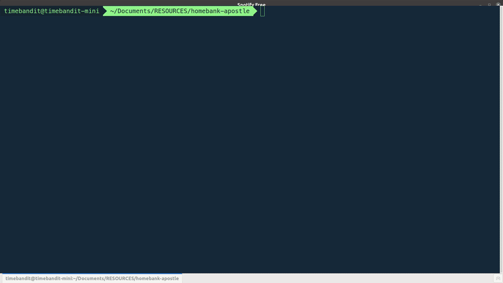

<h1 align="center">
  <br>
  ✨️Homebank Apostle
</h1>

<h4 align="center">A tool to help you convert csv exports into a Homebank compatible format</h4>

<p align="center">
  <a>
    
  </a>
  <a href="https://github.com/TimeBandit/homebank-apostle/workflows/Node.js%20CI/badge.svg">
    
  </a>
  <a href="https://gitter.im/homebank-apostle/homebank-apostle?utm_source=badge&utm_medium=badge&utm_campaign=pr-badge&utm_content=badge">
    
  </a>
  <a href="https://paypal.me/imrannazir?locale.x=en_GB">
    
  </a>
</p>

<p align="center">
  <a href="#key-features">Key Features</a> •
  <a href="#installation">Installation</a> •
  <a href="#usage">Usage</a> •
  <a href="#contributing">Contributing</a> •
  <a href="#license">License</a>
</p>

<h1 align="center">
  
</h1>

## Key Features

This tool was created to convert online banking transaction files to Homebank format. There are two modes of operation. A **parse only** or a **parse to file** mode. Both modes will halt if there is an error in parsing a paticular line during convertion.

## Installation

Clone the repo and `cd` directory into the cloned folder

```console
foo@bar:~$ git clone https://github.com/TimeBandit/homebank-apostle.git
foo@bar:~$ cd homebank-apostle/
```

Install the dependencies, build the source code and run the tests

```console
foo@bar:~$ npm i
foo@bar:~$ npm run create
```

Add a global command called 'hba'

```console
foo@bar:~$ npm run local
```

## Usage

Open a terminal window at the location of your csv files. Run `hba` and follow the on screen prompts. If successful the converted file will be saved to **/parsed** folder.

## Contributing

Pull requests are welcome. For major changes, please open an issue first to discuss what you would like to change.

Please make sure to update tests as appropriate.

To add support for other bank exports you must first create a strategy for it. This tell the tool how to map payment types from your bank to something Homebanks can understand.

Below are the payment types that Homebank currently supports. They correspond to the selectables of the **Payment** dropdown list you see when you edit a transaction in Homebank. The ordering is important

```typescript
export enum HomebankPaymentType {
  None = 0,
  CreditCard = 1,
  Cheque = 2,
  Cash = 3,
  Transfer = 4,
  DebitCard = 5,
  StandingOrder = 6,
  ElectronicPayment = 7,
  Deposit = 8,
  FiFee = 9,
  DirectDebit = 10,
}
```

Create a stategy for your bank that implement the BaseStrategy interface. This maps the payment types for your bank to Homebank transaction types.

## Suported Banks

| Bank  | Homepage                 |
| ----- | ------------------------ |
| Smile | https://www.smile.co.uk/ |

## License

[GPL v3](https://choosealicense.com/licenses/gpl-3.0)
